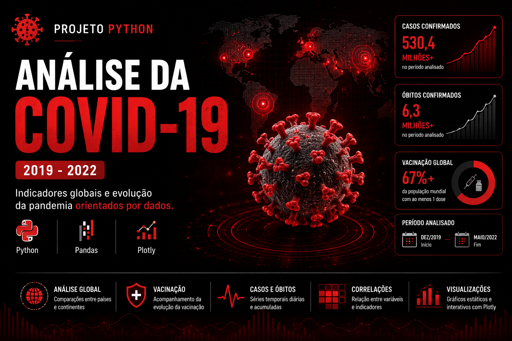

# 🦠 Análise Exploratória da COVID-19 (2019–2022) — Projeto Python
*Python • Pandas • Matplotlib • Plotly • Análise de Dados*



Desenvolvido em 2022, este projeto realiza uma análise exploratória da pandemia global da COVID-19, abrangendo o período entre dezembro de 2019 e maio de 2022.

O objetivo é identificar padrões, tendências e relações entre casos, óbitos, vacinação e características populacionais, utilizando técnicas de análise de dados e visualização.

---

## 🧠 Principais Habilidades

* Python para análise de dados
* Manipulação e tratamento de dados com Pandas
* Visualização de dados com Matplotlib
* Visualizações interativas com Plotly
* Análise exploratória (EDA)
* Correlação entre variáveis
* Storytelling com dados

---

## 📂 Base de Dados

### Informações analisadas

* Casos diários e acumulados;
* Óbitos por milhão de habitantes;
* Vacinação ao longo do tempo;
* População dos países;
* Indicadores relacionados à pandemia.

### Período analisado

📅 Dezembro de 2019 a Maio de 2022

---

## 📊 Principais Análises Desenvolvidas

### 🌎 Evolução da Pandemia

* Crescimento de casos por país e continente;
* Evolução dos óbitos;
* Comparações regionais.

### 💉 Vacinação

* Evolução da vacinação;
* Comparações entre países;
* Relação entre vacinação e indicadores da doença.

### 📈 Visualizações

* Séries temporais;
* Gráficos de linha;
* Correlações entre variáveis;
* Heatmaps;
* Gráficos interativos com Matplotlib.

### 🔎 Exploração dos Dados

* Tendências da pandemia;
* Relações entre variáveis;
* Pontos de inflexão ao longo dos anos;
* Comparações entre continentes.

---

## 🛠 Ferramentas Utilizadas

* Python
* Pandas
* Matplotlib
* Plotly
* Google Colab

---

## 📁 Estrutura do Projeto

```text
Notebook.ipynb
Base de Casos Diários
Dados de Vacinação
População dos Países
README.md
```

---

## 🚀 Como Utilizar

1. Abra o notebook no Google Colab ou Jupyter Notebook;
2. Execute as células sequencialmente;
3. Explore as análises e visualizações desenvolvidas.

---

⭐ Projeto desenvolvido para fins de estudo e composição de portfólio em Análise de Dados.
